# Agente de IA para Automação de Cálculo de VR/VA

Este projeto utiliza um agente de Inteligência Artificial construído com LangChain e Groq para automatizar o complexo processo de cálculo de benefícios de Vale-Refeição (VR) e Vale-Alimentação (VA). A interface, criada com Streamlit, permite que usuários façam o upload de planilhas de funcionários e convenções coletivas em PDF para gerar um relatório de pagamento preciso e auditável.

## Funcionalidades

- **Interface Intuitiva:** Upload de arquivos e configuração de parâmetros através de uma interface web simples criada com Streamlit.
- **Extração Inteligente de Dados:** Utiliza um Large Language Model (LLM) via API da Groq para ler e interpretar cláusulas de benefícios diretamente de arquivos PDF de convenções coletivas.
- **Lógica de Negócio Complexa:** Aplica automaticamente regras de negócio para funcionários ativos, desligados (regra do dia 15), afastados e em férias.
- **Cálculo Proporcional:** Calcula os dias úteis a pagar e o valor do benefício de forma proporcional, considerando admissões e retornos no meio do mês.
- **Flexibilidade e Fallback:** Utiliza valores padrão (fallback) caso uma regra para um sindicato específico não seja encontrada nos documentos.
- **Geração de Relatório:** Consolida todos os cálculos em uma única planilha Excel, pronta para download e utilização pelo departamento financeiro.

## Como Funciona

O fluxograma abaixo ilustra o processo completo executado pelo agente:

```mermaid
graph TD
    A[Início: Usuário acessa o App Streamlit] --> B{Interface Principal};
    B --> C[Sidebar: Upload de Arquivos e Chave API];
    C --> D{Usuário clica em &quot;Executar Agente&quot;};
    D --> E[Verifica a Chave API da Groq];
    E --> F[Carrega Planilhas: Ativos, Desligados, Afastamentos, Férias, Dias Úteis];
    
    subgraph "Preparação dos Dados"
        F --> G[Filtra funcionários ativos];
        G --> H[Processa desligados e afastados para criar lista de exclusão];
        H --> I[Consolida base de funcionários a pagar];
        I --> J[Cria mapa de dias úteis por sindicato];
    end

    subgraph "Extração de Regras com IA"
        K[Loop: Para cada PDF de convenção] --> L[Agente LangChain extrai regras de VR/VA];
        L --> M[LLM Groq interpreta o texto e retorna JSON];
        M --> N[Regras são adicionadas à lista `all_rules`];
        K -.-> N;
    end
    
    J --> K;

    subgraph "Cálculo dos Benefícios"
        O[Loop: Para cada funcionário a pagar] --> P{Cálculo de Dias Úteis};
        P --> P1[Aplica regras de afastamento, férias e desligamento];
        P1 --> Q{Cálculo do Valor Diário VR};
        Q --> Q1[Busca regra do sindicato em `all_rules`];
        Q1 --> Q2[Se não encontra, usa valores de fallback];
        Q2 --> R[Calcula TOTAL, Custo e Desconto];
        O -.-> R;
    end

    N --> O;

    R --> S[Executa Validações Finais];
    S --> T[Exibe Resultados na Tela];
    T --> U[Disponibiliza Download da Planilha Final];
    U --> V[Fim];
```



## Pré-requisitos

- Python 3.9+
- Conda ou um ambiente virtual (`venv`)

## Instalação e Configuração

1.  **Clone o repositório:**
    ```bash
    git clone <URL_DO_SEU_REPOSITORIO>
    cd <NOME_DO_DIRETORIO>
    ```

2.  **Crie e ative um ambiente virtual (Recomendado):**
    ```bash
    # Usando Conda
    conda create -n agente_vr python=3.9
    conda activate agente_vr

    # Ou usando venv
    python -m venv .venv
    source .venv/bin/activate  # No Windows: .venv\Scripts\activate
    ```

3.  **Instale as dependências:**
    ```bash
    pip install streamlit pandas unidecode openpyxl langchain-groq langchain langchain-community pypdf python-dateutil
    ```

4.  **Configure a Chave da API (Groq):**
    - Você pode definir uma variável de ambiente chamada `GROQ_API_KEY` com sua chave.
    - Ou, pode inseri-la diretamente na interface do Streamlit ao executar o aplicativo.

## Como Usar

1.  **Execute o aplicativo:**
    No seu terminal, com o ambiente virtual ativado, execute o comando:
    ```bash
    streamlit run VR_VA_AI_Agent_app.py
    ```

2.  **Utilize a Interface:**
    - A aplicação abrirá em seu navegador.
    - Na barra lateral esquerda, insira sua chave da API da Groq.
    - Faça o upload de todas as planilhas e PDFs necessários. Certifique-se de que os arquivos correspondam aos campos de upload.
    - Clique no botão **"Executar Agente"**.

3.  **Analise os Resultados:**
    - O agente processará os dados, o que pode levar alguns instantes.
    - O resultado final será exibido em uma tabela na tela.
    - Um botão de download aparecerá para que você possa baixar a planilha Excel consolidada.

## Descrição dos Arquivos de Entrada

Para o correto funcionamento, o agente espera os seguintes arquivos com suas respectivas estruturas:

-   **Ativos (.xlsx):** Lista de funcionários ativos. Deve conter `MATRICULA` e `Sindicato do Colaborador`.
-   **Desligados (.xlsx):** Funcionários desligados no mês. Deve conter `MATRICULA`, `COMUNICADO DE DESLIGAMENTO` ('OK' ou vazio) e `DATA_COMUNICADO`.
-   **Afastamentos (.xlsx):** Funcionários em afastamento.
    - Coluna A: `MATRICULA`
    - Coluna B: `DESC.SITUACAO`
    - Coluna C (`na compra?`): Se esta coluna estiver **vazia**, o funcionário é considerado desligado e não receberá o benefício.
-   **Dias Úteis por Sindicato (.xlsx):** Tabela com as colunas `SINDICATO` e `DIAS UTEIS`.
-   **Férias (.xlsx):** Relação de funcionários em férias, com `MATRICULA`, `INICIO_FERIAS` e `FIM_FERIAS`.
-   **Convenções (PDFs):** Arquivos PDF das convenções coletivas de cada sindicato. O agente lerá estes arquivos para extrair os valores dos benefícios.

## Licença

Este projeto é distribuído sob a licença MIT. Veja o arquivo `LICENSE` para mais detalhes.
